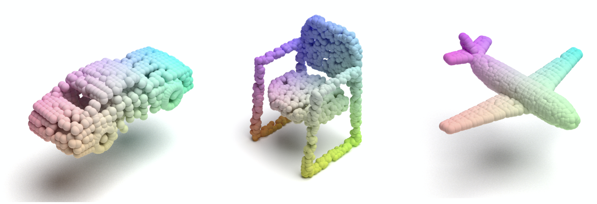

# Point Flow Renderer 3

With a simple command, you can transform your point cloud data into beautifully rendered 3D images.

This XML file describes a 3D scene in the format used by the Mitsuba renderer. 
The script then proceeds to render this scene and save the result as a PNG file. 
If your data tensor contains multiple point clouds, the script will iterate over them and produce multiple renderings.

Currently, the script supports both `.ply` and `.npy` file formats.

This project is inspired by the amazing work done at [Point Flow Renderer](https://github.com/zekunhao1995/PointFlowRenderer). 

Everyone is welcome to use, modify, and distribute Point Flow Renderer 3. 
If you have any enhancements or fixes, I encourage you to share back by making a pull request.

## Dependencies
* Python 3.8
* [Mitsuba 3](http://www.mitsuba-renderer.org/)

Install Mitsuba 3 as python package using this command:

```bash
pip install mitsuba
```

## Instructions

To use the script and render your point cloud data, simply run:
```bash
python point_flow_renderer.py <path_to_your_file>
```

For example:

```bash
python point_flow_renderer.py chair.npy
```

The output PNG file will be saved in the same directory as your input file.

## Examples
Here's a sample rendering:



